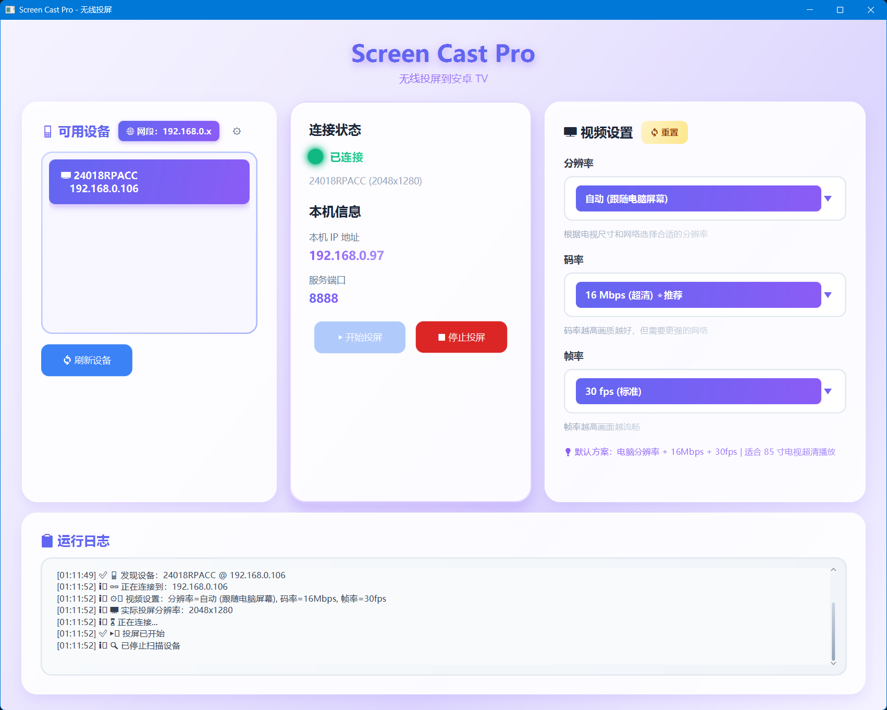
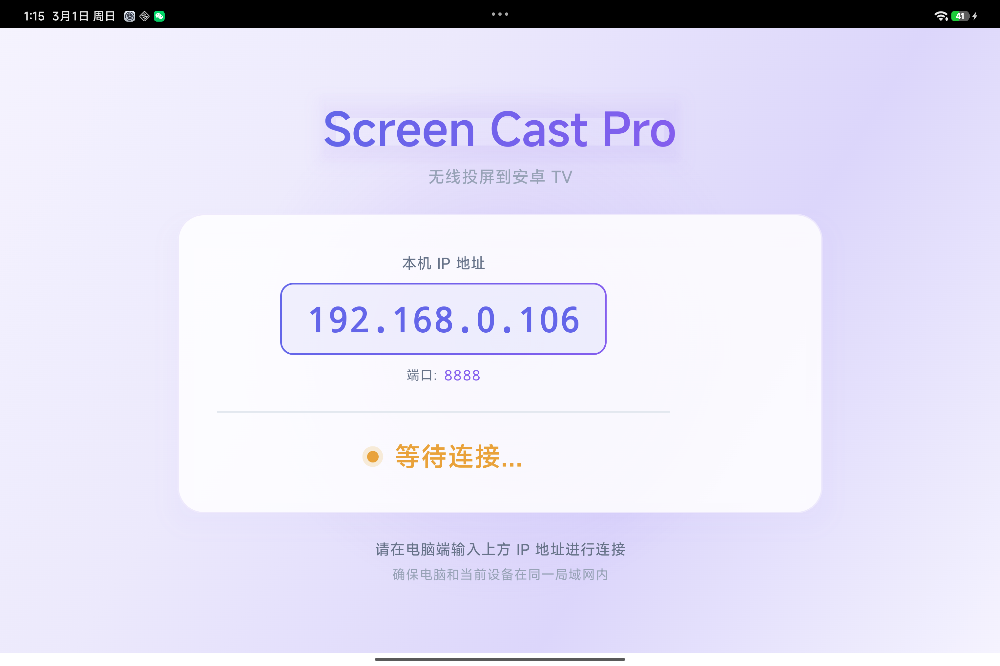

# 🖥️ ScreenCast Pro

<div align="center">


**✨ 高清无线投屏解决方案 | 电脑到安卓TV**

将电脑屏幕无线投射到安卓智能电视，支持高清画质和低延迟传输

</div>

---

## 📱 效果展示

| 电脑端 | TV端 |
|:---:|:---:|
|  |  |

---

## ✨ 功能特性

| 功能 | 描述 |
|:---|:---|
| 🔍 **自动发现** | UDP广播自动发现同一网络下的TV设备 |
| 📺 **高清画质** | 支持720p/1080p/2K/4K分辨率，自适应屏幕 |
| 🎥 **H.264硬编码** | 使用FFmpeg硬件加速编码，高效稳定 |
| ⚡ **低延迟** | 端到端延迟 < 100ms |
| 🔊 **音频同步** | 音视频同步传输 |
| 🎨 **现代化UI** | 玻璃拟态设计风格 |
| 🔄 **动态分辨率** | 自动适配电脑屏幕分辨率 |

---

## 🏗️ 技术架构

```
┌─────────────────┐         ┌─────────────────┐
│   PC 客户端      │  TCP    │   TV 接收端     │
│  (发送端)        │◄───────►│  (接收端)        │
│                 │  8888   │                 │
│  • ScreenCapture│         │  • VideoDecoder│
│  • H.264 Encoder│         │  • MediaCodec   │
│  • Netty Client │         │  • Netty Server │
└────────┬────────┘         └────────┬────────┘
         │                           │
         │ UDP Broadcast (8889)      │
         └───────────┬───────────────┘
                     │
              ┌──────▼──────┐
              │  设备发现    │
              └─────────────┘
```

### 技术栈

| 端 | 技术 |
|:---|:---|
| **PC端** | Java 17, JavaFX, Netty, FFmpeg, JavaCV |
| **TV端** | Kotlin, Jetpack Compose, Netty, MediaCodec |
| **协议** | TCP (视频流), UDP (设备发现) |

---

## 🚀 快速开始

### 环境要求

- **PC端**: Windows 10/11, Java 17+
- **TV端**: Android TV (API 26+), 已开启ADB调试

### 1. 编译PC端

```bash
# 克隆项目
git clone https://github.com/yourusername/screencast-pro.git
cd screencast-pro/pc-client

# 编译
mvn clean package -DskipTests

# 运行
java -jar target/pc-client-1.0.0.jar
# 或双击 start.bat
```

### 2. 安装TV端

```bash
# 连接TV设备
adb connect <TV-IP>:5555

# 安装APK
adb install tv-server/app/build/outputs/apk/release/app-release.apk
```

或在 Android Studio 中打开 `tv-server` 目录直接运行。

### 3. 开始投屏

1. 确保PC和TV在同一WiFi网络
2. 启动TV端应用，记录显示的IP地址
3. 在PC端选择设备并点击连接

---

## 📂 项目结构

```
screencast-pro/
├── pc-client/                  # 电脑端 (发送端)
│   ├── src/main/java/com/cast/pc/
│   │   ├── capture/            # 屏幕捕获 & H.264编码
│   │   ├── config/             # 配置管理
│   │   ├── discovery/          # UDP设备发现
│   │   ├── network/            # Netty TCP客户端
│   │   └── ui/                 # JavaFX界面
│   ├── pom.xml
│   └── start.bat               # Windows启动脚本
│
├── tv-server/                  # TV端 (接收端)
│   ├── app/
│   │   └── src/main/java/com/cast/tv/
│   │       ├── decoder/         # H.264解码
│   │       ├── discovery/       # UDP响应服务
│   │       ├── service/        # TCP投屏服务
│   │       └── ui/             # Compose界面
│   └── build.gradle
│
└── README.md
```

---

## ⚙️ 配置说明

### PC端配置 (config.json)

```json
{
  "videoWidth": 1920,
  "videoHeight": 1080,
  "frameRate": 30,
  "videoBitrate": 8000000,
  "discoveryPort": 8889,
  "serverPort": 8888
}
```

### 分辨率对照表

| 分辨率 | 码率 | 适用场景 |
|:---|:---:|:---|
| 1280×720 | 4 Mbps | 低带宽网络 |
| 1920×1080 | 8 Mbps | 日常使用 |
| 2560×1440 | 12 Mbps | 高清演示 |
| 3840×2160 | 25 Mbps | 4K视频播放 |

---

## 🔧 常见问题

### Q: TV无法被发现？
- 确保PC和TV在同一WiFi网络
- 检查TV是否开启了网络ADB调试

### Q: 投屏延迟高？
- 建议使用5GHz WiFi网络
- 降低分辨率或帧率

### Q: 画面卡顿？
- 检查网络带宽
- 降低视频码率

---

## 🤝 贡献指南

欢迎提交 Pull Request！

1. Fork 本仓库
2. 创建特性分支 (`git checkout -b feature/xxx`)
3. 提交更改 (`git commit -m 'Add xxx'`)
4. 推送分支 (`git push origin feature/xxx`)
5. 提交 Pull Request

---

## 📄 开源协议

本项目基于 MIT 协议开源 - 查看 [LICENSE](LICENSE) 了解详情。

---

## 🙏 致谢

- [JavaCV](https://github.com/bytedeco/javacv) - FFmpeg Java封装
- [Netty](https://github.com/netty/netty) - 高性能网络框架
- [Jetpack Compose](https://developer.android.com/jetpack/compose) - 现代Android UI框架

---

<div align="center">

**如果这个项目对你有帮助，欢迎 ⭐ Star！**

Made with ❤️ by [Your Name]

</div>
